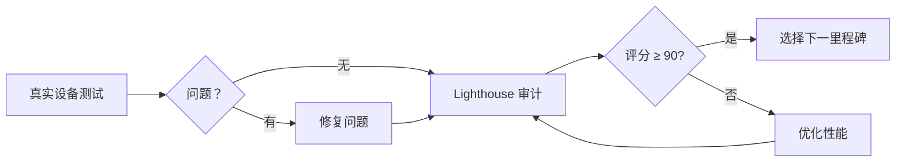

# 🧪 Journal App 测试与审计指南

> **M4 PWA 完成后的质量保证流程**

---

## 📋 测试流程概览



---

## 1️⃣ 真实设备测试

### 前置准备

```bash
# 1. 确保开发服务器运行中
npm run dev

# 2. 获取本地 IP 地址（供移动设备访问）
# macOS/Linux:
ifconfig | grep "inet " | grep -v 127.0.0.1

# 3. 在移动设备浏览器访问
# http://[你的IP地址]:3000
```

### 测试清单

详见 [DEVICE-TESTING-CHECKLIST.md](./DEVICE-TESTING-CHECKLIST.md)

**快速测试 (5 分钟)**:
- [ ] iOS Safari: 添加到主屏幕 → 启动应用 → 验证图标和启动画面
- [ ] Android Chrome: 安装 PWA → 验证图标 → 测试通知权限
- [ ] 离线测试: 开启飞行模式 → 打开应用 → 验证正常访问

**完整测试 (15-20 分钟)**:
使用 [DEVICE-TESTING-CHECKLIST.md](./DEVICE-TESTING-CHECKLIST.md) 中的详细清单

### 问题上报

如发现问题，请使用清单中的问题模板记录：
- 设备信息
- 复现步骤
- 预期 vs 实际结果
- 严重程度（高/中/低）

---

## 2️⃣ Lighthouse PWA 审计

### 运行审计

```bash
# 1. 确保应用在生产模式运行
npm run build
npm run start

# 2. 运行 Lighthouse 审计
npm run lighthouse

# 或指定自定义 URL
LIGHTHOUSE_URL=https://your-app.com npm run lighthouse
```

### 审计结果解读

脚本会生成三份文件（在 `lighthouse-reports/` 目录）：

1. **HTML 报告** (`report-[时间戳].html`)
   - 详细可视化报告
   - 可在浏览器中打开查看

2. **JSON 数据** (`report-[时间戳].json`)
   - 原始审计数据
   - 可用于自动化分析

3. **Markdown 摘要** (`SUMMARY-[时间戳].md`)
   - 关键指标摘要
   - 优化建议
   - 便于分享和存档

### 评分标准

| 类别 | 优秀 | 良好 | 需改进 |
|------|------|------|--------|
| 性能 (Performance) | ≥ 90 | 50-89 | < 50 |
| 可访问性 (Accessibility) | ≥ 90 | 50-89 | < 50 |
| 最佳实践 (Best Practices) | ≥ 90 | 50-89 | < 50 |
| SEO | ≥ 90 | 50-89 | < 50 |
| PWA | = 100 | 50-99 | < 50 |

### 关键性能指标目标

| 指标 | 优秀 | 良好 | 需改进 |
|------|------|------|--------|
| FCP (首次内容绘制) | < 1.8s | 1.8-3.0s | > 3.0s |
| LCP (最大内容绘制) | < 2.5s | 2.5-4.0s | > 4.0s |
| TBT (总阻塞时间) | < 300ms | 300-600ms | > 600ms |
| CLS (累积布局偏移) | < 0.1 | 0.1-0.25 | > 0.25 |
| SI (速度指数) | < 3.4s | 3.4-5.8s | > 5.8s |

### PWA 必须通过的审计项

- ✅ 提供有效的 Web App Manifest
- ✅ 已注册 Service Worker
- ✅ 设置主题色
- ✅ 设置视口元标签
- ✅ 内容在离线时可用
- ✅ 页面加载速度足够快
- ✅ 重定向 HTTP 流量到 HTTPS
- ✅ 配置自定义启动画面
- ✅ 设置地址栏主题色

---

## 3️⃣ 选择下一里程碑

根据测试和审计结果，选择优先级最高的里程碑：

### 选项 A: M6 UI 优化

**适合场景**:
- Lighthouse 性能评分 ≥ 85
- 真实设备测试通过率 ≥ 90%
- 希望强化统计功能的用户体验

**预计工作量**: 4-6 小时

**交付内容**:
- [ ] 目标创建模态弹窗（设定每日/每周/每月写作目标）
- [ ] 统计数据导出按钮（CSV/JSON）
- [ ] 图表交互优化（可点击、筛选）
- [ ] 响应式图表适配（移动端优化）
- [ ] 加载骨架屏
- [ ] 空状态优化

---

### 选项 B: M7 数据导入导出 ⭐ 推荐

**适合场景**:
- Lighthouse 性能评分 ≥ 80
- 用户需要数据备份和迁移能力
- 希望支持跨平台数据同步

**预计工作量**: 6-8 小时

**交付内容**:
- [ ] JSON 格式导出（完整数据）
- [ ] Markdown 格式导出（纯文本 + 图片链接）
- [ ] PDF 格式导出（打印友好）
- [ ] 数据导入功能（支持 JSON）
- [ ] 导入冲突处理（合并/覆盖策略）
- [ ] 导入验证（数据完整性检查）
- [ ] 云同步基础架构（可选）

**为什么推荐**:
- 补全数据安全闭环（加密 + 备份）
- PWA 离线能力已完善，数据迁移是自然延伸
- 用户价值高（防止数据丢失）

---

### 选项 C: M6 统计页 E2E 测试

**适合场景**:
- Lighthouse 评分优秀（全 ≥ 90）
- 希望强化测试覆盖率
- 准备生产发布

**预计工作量**: 3-4 小时

**交付内容**:
- [ ] 统计页基础渲染测试
- [ ] 图表数据正确性测试
- [ ] 筛选器交互测试
- [ ] 目标创建/编辑测试
- [ ] 响应式布局测试
- [ ] 性能基准测试

---

## 🚀 快速启动命令

```bash
# 开发环境
npm run dev                    # 启动开发服务器
npm run test                   # 运行单元测试
npm run e2e                    # 运行 E2E 测试
npm run type-check             # 类型检查

# 生产环境
npm run build                  # 生产构建
npm run start                  # 启动生产服务器
npm run lighthouse             # Lighthouse 审计

# 代码质量
npm run lint                   # ESLint 检查
npm run format                 # Prettier 格式化
```

---

## 📊 成功标准

### 真实设备测试

- **通过率**: iOS/Android 各 ≥ 90% 测试项通过
- **关键功能**: 安装、启动、通知、离线访问 100% 正常
- **严重问题**: 0 个高严重度问题

### Lighthouse 审计

- **PWA 评分**: 100 分（必须）
- **性能评分**: ≥ 85 分（优秀）
- **可访问性评分**: ≥ 90 分
- **最佳实践评分**: ≥ 90 分

### 核心 Web Vitals

- **LCP**: < 2.5s
- **FID**: < 100ms
- **CLS**: < 0.1

---

## 🆘 常见问题

### Q1: Lighthouse 审计失败 "无法访问页面"

**解决方案**:
```bash
# 确保生产服务器在 3000 端口运行
lsof -i :3000

# 如果端口被占用，更换端口
LIGHTHOUSE_URL=http://localhost:3001 npm run lighthouse
```

### Q2: 移动设备无法访问本地服务器

**解决方案**:
```bash
# 1. 确保设备在同一 WiFi
# 2. 检查防火墙设置（允许 3000 端口）
# 3. 使用本机 IP 而非 localhost

# macOS 临时关闭防火墙
sudo /usr/libexec/ApplicationFirewall/socketfilterfw --setglobalstate off
```

### Q3: PWA 安装按钮不显示

**检查清单**:
- [ ] HTTPS 连接（或 localhost）
- [ ] manifest.json 格式正确
- [ ] Service Worker 注册成功
- [ ] 满足可安装性条件（用户至少访问 2 次）

### Q4: 通知权限被拒绝后如何重置

**iOS Safari**:
```
设置 → Safari → 高级 → 网站数据 → 删除对应域名
```

**Android Chrome**:
```
设置 → 应用 → Chrome → 权限 → 通知 → 允许
```

---

## 📚 参考资源

- [PWA 检查清单](https://web.dev/pwa-checklist/)
- [Lighthouse 评分计算](https://developer.chrome.com/docs/lighthouse/performance/performance-scoring/)
- [Core Web Vitals](https://web.dev/vitals/)
- [Service Worker 最佳实践](https://web.dev/service-worker-mindset/)

---

## 下一步行动

1. **立即执行**: 完成真实设备测试 → 填写 [DEVICE-TESTING-CHECKLIST.md](./DEVICE-TESTING-CHECKLIST.md)
2. **审计验证**: 运行 `npm run lighthouse` → 检查评分
3. **决策分支**: 根据结果选择下一里程碑（推荐 **M7 数据导入导出**）

---

🎯 **目标**: 确保 M4 PWA 在真实环境中完美运行，为下一阶段开发打好基础。
